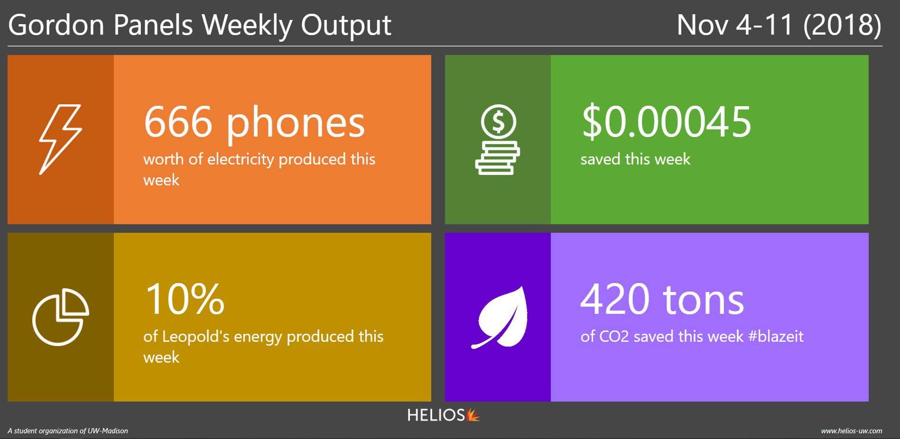
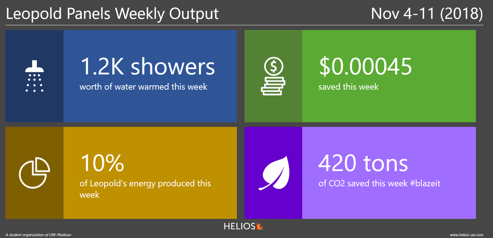

# Helios-Dashboard
Energy dashboard created by the Helios student organization for the University of Wisconsin - Madison.

## Instructions for Modification (Please Follow...)

Whenever new files are added/renamed that are not build/version control related (ie. .gitignore, buildspec.yml, README.md...),
please update the 'artifacts' section of buildspec.yml as follows:

### Before adding/renaming new files

artifacts:
  files:
    - img/*
    - Dashboard.css
    - Dashboard.html

### After adding/renaming new files (Dashboard_ST.html, renaming Dashboard.html to Dashboard_PV.html)

artifacts:
  files:
    - img/*
    - Dashboard.css
    - Dashboard_PV.html
    - Dashboard_ST.html

Also ensure that you read up on how to edit buildspec.yml; the spacing requirements are very rigid
(tabs vs spaces, and indents matter).

## Overview

This version contains the following designs:

### PV Panels Dashboard

### PV Panels Dashboard

